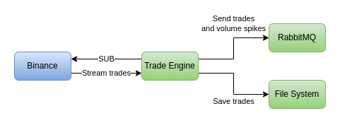
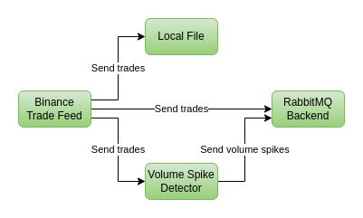
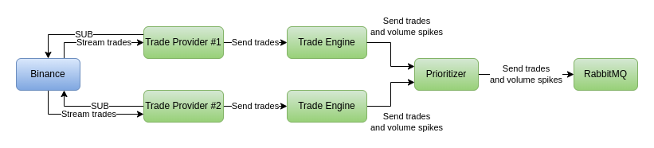

# Description

A trade engine which processes crypto trades using Binance feed

# Goals

### Functional

* Receive trades from Binance for specific symbols
* Display trades on the console
* Write trades in a local text file
* Detect volume spikes and display them on the console
* Send trades and volume spikes to RabbitMQ

### Non-functional

* Process trades in real time
* Write trades and volume spikes as fast as possible

### Additional non-functional

* Create app configuration
* Add automated tests
* Have clean code
* Have efficient design

# System design



Extremely simple with very few components

# Internal design



* Represents a simplified and efficient implementation of [the actor model](https://doc.akka.io/docs/akka/current/typed/guide/actors-intro.html)
* Uses [System.Threading.Channels](https://devblogs.microsoft.com/dotnet/an-introduction-to-system-threading-channels/) to facilitate data transfer between different actors
* Because of this design there is no need for locking and synchronization, which improves performance
  - Of course the channels have integrated synchronization, but it's low level and very fast
  - Additionally all 4 channels have exactly 1 writer and 1 reader which reduces contention
* Alternative frameworks that are relevant
  - [Akka.NET](https://getakka.net/)
  - [.NET Orleans](https://learn.microsoft.com/en-us/dotnet/orleans/overview)

# Run

### Configuration

First, one should check the configuration

#### Properties/launchSettings.json

If project is ran from the IDE, environment variables there could override both user secrets and `appsettings.json`

#### Binance API key and secret

* Stored using [.NET user secrets](https://learn.microsoft.com/en-us/aspnet/core/security/app-secrets?view=aspnetcore-6.0) so they aren't committed to the repo
* The values could be applied using the docs above, result should be:
```bash
$ dotnet user-secrets list --project Crypto.TradeEngine/
Binance:ApiKey = value
Binance:ApiSecret = value
```
* Alternatively the values could simply be added to the `appsettings.json`
```json
{
  "Binance": {
    "ApiKey": "value",
    "ApiSecret": "value"
  }
}
```

#### The rest of the config

In `appsettings.json` we have
```json
{
  "Console": {
    "OutputEnabled": true // whether to see trades and volume spikes in console
  },
  "RabbitMQ": { // most are self-explanatory
    "Hostname": "localhost",
    "Port": 5672,
    "VirtualHost": "test-vhost",
    "ConnectTimeout": "00:00:05.0", // the TimeSpan format is hours:minutes:seconds.milliseconds
    "UserName": "test",
    "Password": "secret" // not secret since this is a local instance created by docker compose
  },
  "LocalFile": {
    "LocalFilePath": "binance-trades.txt" // could be a full path, too
  }
}
```

While in `symbols.json` we have generated symbol config for 128 symbols:
```json
{
  "SymbolConfig": {
    "Symbols": [ // remove symbols you're not insterested in
      {
        "Symbol": "BNBUSDT", // official symbol string
        "DisplayText": "BNB/USDT", // how it is displayed in the console
        "CurrencySymbol": "$", // what currency symbol is displayed after price
        "VolumeSpike": { // each symbol has different volume spike settings, can easily be made global for all
          "Length": 10, // how many trades are kept in memory to determine if there's a spike
          "Interval": "00:05:00.0", // how fresh the trade needs to be since older are purged, TimeSpan format is hours:minutes:seconds.milliseconds
          "Ratio": 5.0 // how many times a volume spike needs to be greater than the average of trades kept in memory 
        }
      }
    ]
  }
}
```

### RabbitMQ

* Runnable via `docker compose -f docker-compose.yml up -d`
* The management plugin is enabled and can be used via [http://localhost:15672/](http://localhost:15672/)

### TradeEngine

* It's not containerized, so it needs .NET 6.0 installed
* Developed on Ubuntu 22.04.1 using JetBrains Rider
* Runnable via Ctrl+F5 in the IDE
* Observe the messages
* Press ENTER to stop

# Automated testing

The TDD principles followed are explained by [Ian Cooper](https://mvp.microsoft.com/en-us/PublicProfile/8975?fullName=Ian%20Cooper) in [this YouTube video about TDD](https://www.youtube.com/watch?v=EZ05e7EMOLM)

### Approach

* We bootstrap the whole application using the DI container
* We use inheritance and virtual methods to modify slightly a few classes which override DI container registrations, as can be seen in `TestStartup`
* We replace entirely the `BinanceTradeFeed` with `TestTradeFeed` so we have deterministic test input

### Data-driven

* The code to run a specific test is relatively small and is generic
  - We don't take into account the test infrastructure :)
* A lot of the variability comes from the different test data
* This way the testing becomes very data driven which is excellent
  - Test data could be in text/XML/JSON/YAML/etc. files
  - Even non-technical people can write test data

### Flaky-ness

* RabbitMQ is kept as part of the testing, so there's a lot of asynchronous operations
* Additionally each actor in the app has 1 or 2 worker threads running in the background
* That's why testing incorporates delays in order to deal with that, but this can make tests flaky or inconsistent
  - Once before all tests are ran all trades (1 second) and volume spikes (1 second) are purged from RabbitMQ
    - That could fail if there are too many, the management plugin can be used to purge them beforehand
    - Increasing those intervals makes running tests very uncomfortable...
  - Before each test either trades or volume spikes are purged from RabbitMQ (1 second)
  - Each test is given 2 seconds to complete
    - If something becomes slow the test assertion would fail
    - Observe the console output of each test since trades and volume spikes are shown there, as are all app logs

# Improvements

### Alternative system design



* Not **necessarily** better, just different
  - The logic could be split to 2 components
    - Trade provider (Binance or other) - transforms provider-specific data into the internal format
    - Trade engine - detects volume spikes and performs other logic
  - Additionally, there could be added different providers for redundancy
  - A prioritizer can pick the best provider if one becomes slow or experiences an outage
* Pros
  - Support for various trade providers
  - Runtime flexibility to choose one trade provider over the other
  - Efficient implementation in different languages
  - Better parallel development
* Cons
  - **Drastically** complicates dev and operations
  - Adds _some_ latency, although nothing statistically significant

### Other improvements

* Maintainability
  - Automated code quality verification, e.g. SonarQube
  - Detailed code reviews
  - Automated testing for both correctness and performance
* Scalability
  - Distribute symbols among a set of instances
* Reliability
  - Figure out how not to lose trades - check Binance/another provider documentation
  - Make sure outages of Binance/RabbitMQ/other dependencies are handled
  - Rely on infra to quickly replace instances that go down
* Durability
  - Make RabbitMQ queues durable
  - Consider switching to Kafka/AWS Kinesis which don't erase a message once it is read
  - Add another consumer to persist messages to a time-series or another appropriate DB
* Add observability
  - Metrics
    - histograms for trades received/sent to RabbitMQ, for volume spikes detected
    - latency for trade processing, for volume spikes
    - system resources such as CPU, network IO, disk IO etc.
  - Log aggregation
  - Consider if tracing is applicable
  - [Open Telemetry](https://opentelemetry.io/) is gaining momentum
* Configuration
  - Centralized and redundant storage for configuration: SQL-based or another database
  - Dynamic configuration which evaluates based on metrics how to best distribute symbols among instances
* Pipelines
  - A CICD pipeline to lint, build, test, verify code quality, package
  - Containerize the components so they could be deployed in Kubernetes
* Deployment
  - Kubernetes could effectively orchestrate component containers
  - StatefulSet could map each instance ID to a dedicated set of symbols to process
* Various TODOs in code mention a number of considerations for low/medium level improvements
